# Multi-Agent Architecture: The "Orchestrator" Pattern 🤖🤖🤖

To make agents work together, we use a design pattern called the **Orchestrator** (or "The Boss").

## How it Works

Instead of the User talking directly to the Data Analyst, the User talks to the **Orchestrator**. The Orchestrator does not do the work itself; it acts like a Project Manager.

1.  **Orchestrator**: Listens to the user and decides *who* is best suited to do the job.
2.  **Specialists**: The actual agents (Analyst, Cleaner, Writer) who perform the tasks.

---

## Scenario: "Clean this file and write a report on sales trends."

Here is the step-by-step flow:

1.  **User** sends the request.
2.  **Orchestrator** thinks: *"First I need to clean the data, then analyze it, then write a report."*
3.  **Step 1**: Orchestrator sends data to **Cleaner Agent**.
    *   *Cleaner*: "I fixed 50 missing rows." -> Returns clean data.
4.  **Step 2**: Orchestrator sends clean data to **Data Analyst**.
    *   *Analyst*: "Sales increased by 20%." -> Returns insights + charts.
5.  **Step 3**: Orchestrator sends insights to **Report Writer**.
    *   *Writer*: "Here is the PDF." -> Returns final file.
6.  **Orchestrator** delivers the PDF to the User.

---

## Visual Diagram

```mermaid
graph TD
    User((User)) -->|1. Request| Boss[Orchestrator Agent]
    
    Boss -->|2. Send Raw Data| Cleaner[🧹 Data Cleaner Agent]
    Cleaner -->|3. Return Clean Data| Boss
    
    Boss -->|4. Send Clean Data| Analyst[📊 Data Analyst Agent]
    Analyst -->|5. Return Insights| Boss
    
    Boss -->|6. Send Insights| Writer[📝 Report Writer Agent]
    Writer -->|7. Return PDF| Boss
    
    Boss -->|8. Final Response| User
```

## Why uses this pattern?
*   **Specialization**: The "Cleaner" doesn't need to know how to draw charts. It just cleans.
*   **Complexity**: You can build very complex workflows without creating one giant, confused brain.
*   **Scalability**: You can easily add a "SQL Agent" or "Search Agent" later just by telling the Orchestrator about them.
