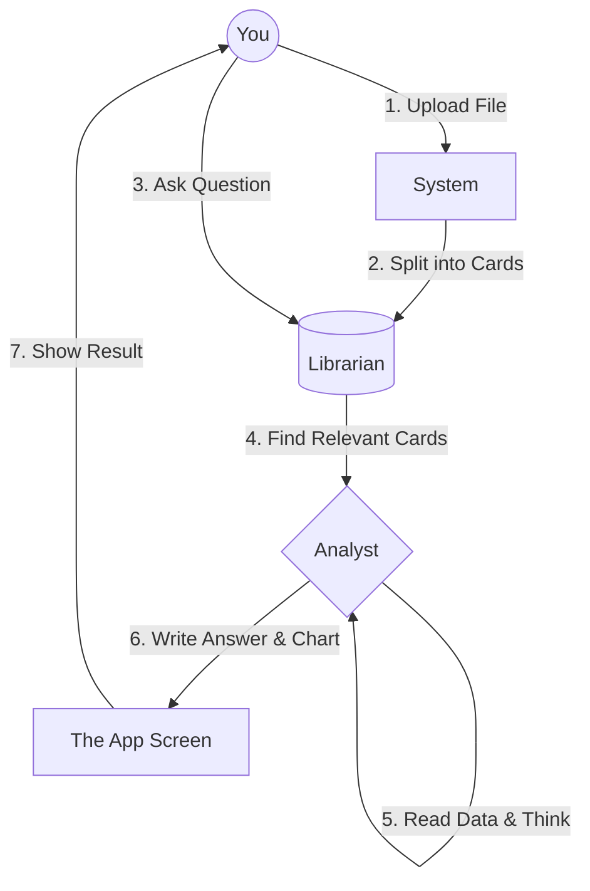

# How It Works: The "Librarian & Analyst" Workflow 🤝

Think of this app as a team of two people working for you:
1.  **The Librarian** (ChromaDB) 📚
2.  **The Analyst** (Gemini AI) 🧠

---

## Part 1: Storing Your Data (Upload Phase)

When you upload your **CSV file**, here is what happens:

1.  **You** give the file to the system.
2.  **The System** cuts your file into small "cards" (chunks).
    *   *Card 1:* "Date: Jan 1 | Sales: $500"
    *   *Card 2:* "Date: Jan 2 | Sales: $600"
3.  **The Librarian (ChromaDB)** takes these cards and files them away organized by **meaning**.
    *   It puts "Sales" cards in one drawer.
    *   It puts "Product Name" cards in another.

> **Result**: Your data is now "indexed" and ready to be searched.

---

## Part 2: Asking a Question (Chat Phase)

When you ask: *"Show me a line chart of Total Revenue over Date"*

1.  **You** ask the question.
2.  **The Librarian (ChromaDB)** looks through the drawers.
    *   It thinks: *"The user wants 'Revenue' and 'Date'. Let me grab all the cards that talk about those two things."*
    *   It pulls out the 5-10 most relevant cards.
3.  **The Librarian** hands those specific cards to **The Analyst (Gemini)**.
    *   *"Hey Analyst, here is the data the user asked about. Please answer them."*
4.  **The Analyst (Gemini)** reads the cards and follows your instructions.
    *   It calculates the totals.
    *   It writes a summary: *"Revenue is increasing..."*
    *   It draws the chart (by writing JSON code).
5.  **The App** shows you the text and draws the chart on your screen.

---

## Visual Diagram

## Why do we do this?
*   **Speed**: The Analyst doesn't have to read the whole library, only the 5 cards that matter.
*   **Cost**: Reading fewer words is cheaper and faster.
*   **Focus**: The Analyst gets less confused because it only sees relevant information.
